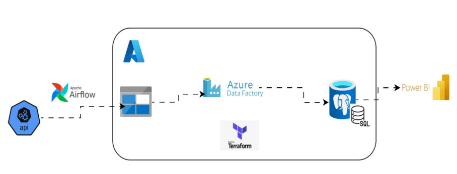
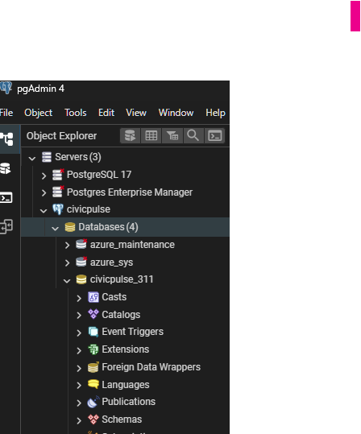

# Terraform-ELT-pipeline-for-Transparent-City-Metrics (NYC 311 API)  by CivicPulse 311

A Cloud-native ELT pipeline for NYC 311 data, built with Terraform, Airflow, and Azure. Enables real-time ingestion, transformation, and reporting via Power BI. Designed for resilience, transparency, and operational insight into the city service metrics.

## Business Challenge and Objectives

CivicPulse 311 addresses the evolving demands of NYC’s non-emergency service ecosystem by transforming raw 311 data into actionable, real-time intelligence. Key challenges include:
        - **Customer Demand**: Need for live, explainable insights and equity views across neighborhoods.
        - **System Reliability**: Ensuring robust orchestration and anomaly detection in data pipelines.
        - **Data Latency & Scalability**: Managing peak volumes without lag, and supporting schema evolution.

### Project Objectives

The project aims to deliver a resilient, cloud-native ELT pipeline with:
        - **Scalable Near Real-Time Ingestion**: Fault-tolerant extraction from the NYC 311 API.
        - **Real-Time Reporting Tools**: Power BI dashboards for volumes, SLA compliance, and complaint mix.
        - **Enhanced Data Accuracy**: Validated movement from raw source to curated database layers.
        - **Improved System Monitoring**: Instrumentation and alerts for pipeline health and data quality.

## Architecture & Setup

### Architecture



API  →  Airflow (Extract)  →  Azure Blob Storage  →  Azure Data Factory[ADF (Load + Orchestrate)]  →  Azure PostgreSQL (Transform in SQL) →  Power BI

| Layer                | Tool                     | Purpose                                                         |
| -------------------- | ------------------------ | --------------------------------------------------------------- |
| **E (Extract)**      | Apache Airflow           | Fetch data from an API and save it to Azure Blob (`raw/`)       |
| **L (Load)**         | Azure Data Factory (ADF) | Copy data from Blob → PostgreSQL staging table                  |
| **T (Transform)**    | PostgreSQL (SQL scripts) | Clean & reshape data inside the DB for Power BI                 |
| **Visualization**    | Power BI                 | Build dashboards from the warehouse tables                      |
| **Infra management** | Terraform                | Create Azure resources (Blob Storage, Postgres, ADF, Key Vault) |

### Repo structure

```bash
Terraform-ELT-pipeline/
├─ terraform/                  # Terraform IaC (infrastructure)
│   ├─ main.tf
│   ├─ variables.tf
│   ├─ providers.tf
│   ├─ backend.tf              # The orchestration brain. Creates the resource group, then calls module
│   ├─ backend.hcl              
│   ├─ outputs.tf              # surfaces useful info after apply (e.g., pg_fqdn to connect psql).
│   └─ terraform.tfvars
│   └─ tfplans/
│   
│
├─ sql/                        # Database setup (staging + DWH)
│   ├─ stg/
│   │   ├─ api_311_raw.sql      # SQL scripts for loading from azure - creates a staging table to hold jsonb payloads
│   │   └─ sample_insert.sql
│   └─ dwh/
│       ├─ schema.sql
│       └─ transform_load.sql   # reads recent staging rows, flattens JSON into columns,upserts by request_id.
│
├─ astro-civicpulse/            # Astronomer Airflow DAGs (EXTRACT layer: keeps are required scripts, variables ,DAG, etc)
│   ├─ nyc_311_to_blob.py      # 
│ 
│
├─ scripts/
│   ├─ db_init.sh              # runs SQL init sequence
│   ├─ tf_run.sh               # terraform automation script
│   └─ requirements.txt        # python dependencies
│
├─ .env                        # shared credentials (used by Airflow and scripts)
├─ README.md
└─ .gitignore


Terraform-ELT-pipeline/
├─ terraform/
│  ├─ main.tf                 # ADF + Linked Services + Datasets + Pipeline + Trigger
│  ├─ variables.tf            # All inputs (RG name, ADF name, conn strings, etc.)
│  ├─ providers.tf            # azurerm provider + versions
│  ├─ backend.tf              # Remote state backend block (azurerm) + reconfigure notes
│  ├─ backend.hcl             # storage_account_name, container_name, key (no secrets)
│  ├─ outputs.tf              # ADF names, pipeline name, trigger, etc.
│  ├─ terraform.tfvars        # your non-secret defaults (keep secrets out)
│  └─ tfplans/                # optional: where you save `terraform plan -out=...`
│
├─ sql/
│  ├─ stg/api_311_raw.sql
│  └─ dwh/{schema.sql, transform_load.sql}
│
├─ astro-civicpulse/
│  └─ dags/nyc_311_to_blob.py
│
├─ scripts/
│  ├─ init.sh                 # SAFE terraform init using env/tag filters (revised)
│  ├─ tf_run.sh               # plan/apply helper
│  └─ requirements.txt
│
├─ .env
├─ README.md
└─ .gitignore


```

## Infrastructure with Terraform

- ***install Terraform and Azure CLI first.***

A.) Infrastructure Resources/ Modules

- **Resources:** [Terraform Registry](https://registry.terraform.io)
- Create and activate a virtual env: python -m venv .venv

1. Terraform builds the Azure pieces:
        - Resource Group
        - Storage Account (Blob)
        - Azure PostgreSQL Flexible Server
        - Azure Data Factory

B.) Install tools

```bash
# Install Azure CLI
winget install --exact --id Microsoft.AzureCLI
az upgrade

# Install Terraform
choco install terraform       # Windows

# Login to Azure
az login # or az login --tenant <tenant-id>
az account set --subscription "<your-subscription-id>"

# check active subscription
az account show

```

C.) Terraform configuration files

- Create a terraform/ folder like above

## Usage - How to run (ground up)

### Deploy Azure and services with Terraform: Initialize + apply in project_root or project_root/terraform

#### In project root (Auto)

```bash
#  Create Terraform remote state
chmod +x ./scripts/setup_backend.sh
./scripts/setup_backend.sh
```

```bash
# from project root
chmod +x ./scripts/tf_run.sh

# Normal plan/apply (with outputs printed at the end):
./scripts/tf_run.sh

# Create a fresh backend with a new storage account and auto-write backend.hcl:
CREATE_BACKEND=true WRITE_BACKEND=true ./scripts/tf_run.sh

RESET=true ./scripts/tf_run.sh # clean local metadata (fresh start), then deploy

# to redeploy 
RESET=true DO_DESTROY=true NUKE_RG="" CREATE_BACKEND=true WRITE_BACKEND=true ./scripts/tf_run.sh

# Destroy first, then nuke RG, then stop (no deployment)
DO_DESTROY=true NUKE_RG="" EXIT_AFTER_CLEANUP=true ./scripts/tf_run.sh

# If you changed the backend manually and want to move state:
MIGRATE_STATE=true ./scripts/tf_run.sh

# try destroy using current backend, then deploy or not
DO_DESTROY=true ./scripts/tf_run.sh 
DO_DESTROY=true EXIT_AFTER_CLEANUP=true ./scripts/tf_run.sh # no deployment

# nuke the RG (defaults to RG in backend.hcl), wait for deletion, then recreate backend and deploy or not
NUKE_RG="" CREATE_BACKEND=true ./scripts/tf_run.sh
EXIT_AFTER_CLEANUP=true ./scripts/tf_run.sh # no deployment

# Show outputs any time:
terraform -chdir=terraform output
        # This shows values like:postgres_fqdn, database, data_factory_name, storage_account_name, etc.
```

#### In project_root/terraform (Manual)

A.) Install: Terraform ≥ 1.6, Azure CLI ≥ 2.58 at project root
        - Login + select subscription:

```bash
az login --tenant <YOUR_TENANT_ID>   # e.g. the Default Directory tenant GUID
az account set --subscription <YOUR_SUBSCRIPTION_ID>

# verify
az account show --query "{name:name, sub:id, tenant:tenantId}" -o tsv

# List all subs/resources you can see (refresh tokens)
az account list --refresh -o table
az resource list --output table
terraform destroy #to delete all resources in current state (for a re-deployment)
```

B.) Make sure the Storage resource provider is registered (1-time per subscription)

```bash
az provider register --namespace Microsoft.Storage
az provider show --namespace Microsoft.Storage --query "registrationState" -o tsv
# Wait until it prints Registered
az provider show -n Microsoft.Storage
```

C.) Create Terraform remote state

```bash
# vars to create
LOCATION="uksouth"
RESOURCE_GROUP="tf-backend-rg"
STACCOUNT="sabackend$RANDOM"   # must be globally unique, lowercase only
CONTAINER="tfstate"

az group create -n $RESOURCE_GROUP -l $LOCATION
az storage account create -n $STACCOUNT -g $RESOURCE_GROUP -l $LOCATION --sku Standard_LRS --kind StorageV2
az storage container create --account-name $STACCOUNT --name $CONTAINER --auth-mode login

echo "RG=$RESOURCE_GROUP  ST=$STACCOUNT  LOC=$LOCATION  CT=$CONTAINER"
# copy STACCOUNT name into backend.hcl/backend.tf
```

D.)  Fmt, Init, Validate, Plan, Apply

```bash
cd Terraform-ETL-pipeline/terraform
# rm -rf .terraform .terraform.lock.hcl (for a re-deployment)

terraform fmt        # (optional, formats cleanly)

terraform init 

#If  403 error: Run the init.sh script with below
chmod +x init.sh
./init.sh

terraform validate
terraform plan -out=tfplans/$(date +%Y-%m-%d_%H%M)-pg-azurefirewall-update.tfplan
terraform apply "*.tfplan" -auto-approve
```

- If ERROR when applying:
 Error: `zone` can only be changed when exchanged with the zone specified in `high_availability.0.standby_availability_zone`with azurerm_postgresql_flexible_server.pg,
   Find the current zone with below and pin to     azurerm_postgresql_flexible_server

```bash
az postgres flexible-server show \
  -g rg-civicpulse-dev \
  -n pg-civicpulse-dev \
  --query "availabilityZone" -o tsv
```

E.)  Post-apply quick tests & Validation Steps

```bash
# Outputs
terraform output
az resource list --output table

# Storage Access
az storage container list --account-name $(terraform output -raw storage_account_name) --auth-mode login -o table

# Postgres Connectivity (local Power BI / psql)
PGHOST=$(terraform output -raw postgres_fqdn)
PGDATABASE=$(terraform output -raw database)
PGUSER=${TF_VAR_pg_admin_user:-pgadmin}

psql "host=$PGHOST dbname=$PGDATABASE user=$PGUSER sslmode=require" -c "\l"
```

OR UI
        - pgAdmin 4: Download
        - Azure Data Studio: connect with:
                - Server: <postgres_fqdn from Terraform output>
                - Port: 5432
                - Username: pgadmin
                - Password: ${TF_VAR_pg_admin_pwd}
                - SSL mode: Require


### SQL Initialisation

#### Required Columns for CivicPulse 311 Objectives

- To align with the **business challenge and project objectives**, the following columns from the NYC 311 dataset are essential for building explainable, real-time operational intelligence:
1.) Temporal Analysis
        - `created_date` – For tracking request volumes and latency
        - `due_date` – For SLA compliance and backlog aging
        - `resolution_action_updated_date` – For resolution timing and status updates

2.)  Agency & Complaint Insights
        - `agency` / `agency_name` – To segment by responsible department
        - `complaint_type` – For categorizing service demand
        - `descriptor` – For more granular issue classification
        - `status` – To monitor open vs. closed cases

3.) Location Intelligence
        - `borough` – For borough-level equity and volume analysis
        - `incident_zip` – For zip-level mapping
        - `incident_address` / `street_name` – For geospatial joins and clustering
        - `community_board` – For local governance insights
        - `latitude` / `longitude` – For mapping and spatial analytics

4.) Operational Metrics
        - `resolution_description` – For qualitative resolution tracking
        - `location_type` / `facility_type` – For service context
        - `open_data_channel_type` – To analyze request origin (e.g., phone, app)

5.) Optional but Useful for Enrichment
        - `bbl` – For property-level joins with NYC datasets
        - `address_type` – For filtering valid addresses
        - `park_facility_name` / `park_borough` – If analyzing parks-related complaints
        - `cross_street_1`, `cross_street_2`, `intersection_street_1`, `intersection_street_2` – For traffic or intersection-related issues

#### Initialise DB in project root

```bash
# make executable
chmod +x ./scripts/db_apply.sh

# First-time end-to-end (staging → schema → transform):
./scripts/db_apply.sh --all

# Daily refresh (transform only):
./scripts/db_apply.sh --transform

# force credentials:
PGUSER=pgadmin PGPASSWORD='***' ./scripts/db_apply.sh --transform

```

1.) test with sample file

```bash
./scripts/db_apply.sh --all

./scripts/db_apply.sh --transform
```

### Airflow (local @ Astronomer @  http://localhost:8081)

#### Resources

- https://www.astronomer.io/docs/astro/cli/install-cli
- https://www.astronomer.io/docs/learn/get-started-with-airflow
- https://www.datacamp.com/tutorial/getting-started-with-apache-airflow

```powershell
Get-NetTCPConnection -LocalPort 5432/8080 | Format-Table -Auto
Get-Process -Id 39260
Get-Service *postgres* | Select Name, Status
Stop-Service -Name postgresql-x64-18 /// Stop-Process -Id 5356 -Force
```

```bash
 mkdir astro-civicpulse
 cd /mnt/d/Portfolio/Terraform-ELT-pipeline/astro-civicpulse
 astro dev init

# astro config set webserver.port 8090
# astro config set postgres.port 5440 

astro dev start
astro dev stop

astro dev kill
astro dev restart

➤ Airflow UI: http://localhost:8080
➤ Postgres Database: postgresql://localhost:5432/postgres
➤ The default Postgres DB credentials are: postgres:postgres

astro dev logs --scheduler | tail -n 20
astro dev logs --scheduler --follow

astro dev run dags list
astro dev run dags list-import-errors
# ----------------------------------------------------------
# check blocked port on powershell
netstat -aon | findstr :8080
asklist /FI "PID eq 5908"


docker stop $(docker ps -a --filter "name=astro" -q)
docker rm $(docker ps -a --filter "name=astro" -q)

astro dev kill
#docker system prune -af --volumes
astro dev restart

astro dev ps
cat .astro/config.yaml
```

### ADF (Load + Transform)

- In ADF Studio, create:
        - Linked Services: Blob (your storage) and PostgreSQL (to civicpulse_311, SSL on).
        - Datasets: Blob JSON input, Postgres stg.api_311_raw output.
        - Pipeline: Copy (Blob→Postgres) → Script (SELECT dwh.run_311_transform();).
        - Trigger: hourly schedule or Blob event trigger for raw/api/311/**.

## Power BI

<!-- - Connect to Azure PostgreSQL → DB civicpulsedb → view dwh.v_311_requests.
- Build visuals (Import mode for speed, DirectQuery for freshness). -->