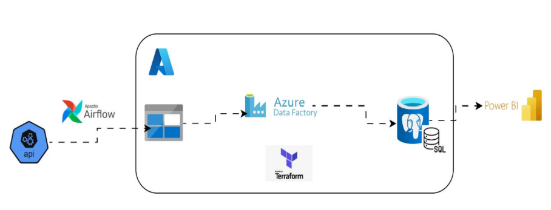
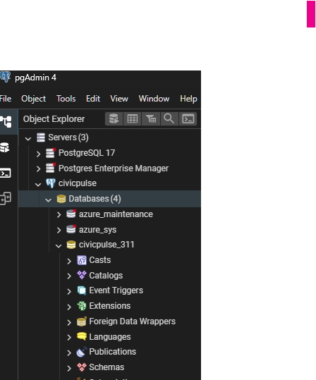
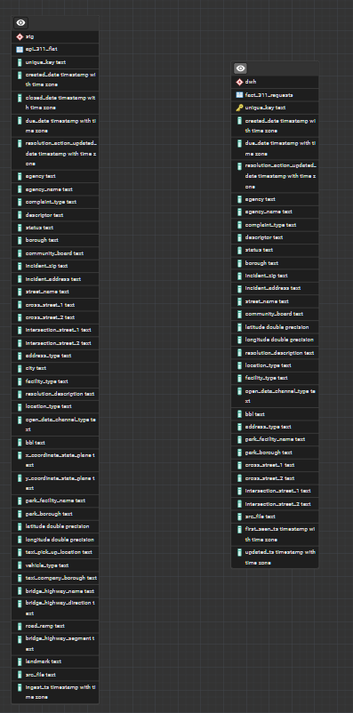
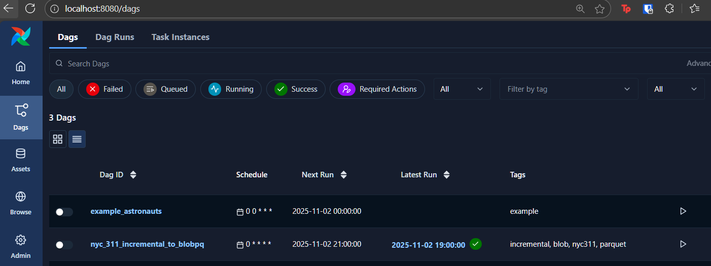
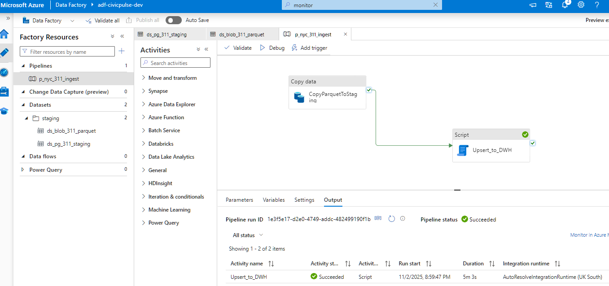

# **CivicPulse 311 — Urban Cities Live Service Intelligence & Reporting**

## **Background Story**

CivicPulse 311 is part of the *Urban Cities Live Service Intelligence* initiative — a public-sector analytics solution built to provide **real-time operational visibility** into NYC’s 311 non-emergency service requests.  

This project automates the **entire ELT pipeline** — from data ingestion to dashboarding — combining:

- **Airflow (Astronomer)** for API extraction and orchestration  
- **Terraform** for reproducible infrastructure provisioning  
- **Azure Data Factory** and **PostgreSQL** for transformation and load  
- **Power BI** for visualization  

The goal: To build a Data Platform that will process the data from the [NY311 rest API](https://data.cityofnewyork.us/resource/erm2-nwe9.json) into a cloud based Database/Data Warehouse for predictive analytics which will empower civic agencies and data teams to measure service efficiency, SLA compliance, and equity outcomes across boroughs by

### **Business Challenge**

| Theme | Description |
|--------|--------------|
| **Manual Processes** | Data analysts manually downloaded 311 datasets and performed transformations offline. |
| **Data Latency** | Data refresh took >24 hours, limiting decision-making accuracy. |
| **Scalability** | No automated schema validation or incremental ingestion. |
| **Governance** | Infrastructure was manually configured, lacking IaC traceability. |

### **Objectives**

1. Build a **fully automated data pipeline** using Airflow, Terraform, and ADF.  
2. Ingest, validate, and load **NYC 311 service request data** incrementally.  
3. Transform raw JSON to analytical tables with **PostgreSQL upserts**.  
4. Serve data into **Power BI dashboards** for SLA and operational reporting.  

## Project Setup

This provides instructions on how to setup the project environment and provision necessary configurations

### Requirements

- A virtual environment (python -m venv myenv  # Create virtual environment)
- Python 3.10 + higher
- Azure Cloud [Storage Account, PostgreSQL, Container Registry, Data Factory]
- Astronomer Airflow
- Terraform
- Docker Desktop
- Microsoft Power BI

### **High-Level Flow**

NYC 311 API  →  Airflow (Astronomer)  →  Azure Blob (Parquet)
             →  ADF Copy Activity  →  PostgreSQL (stg → dwh)
             →  Power BI Dashboards

### **Solution Architecture**



```bash
| Layer | Tool | Purpose |
|-------|------|----------|
| **Infrastructure (IaC)** | Terraform | Creates Azure RG, Storage, ADF, Postgres, Linked Services |
| **Extract (E)** | Airflow (Astronomer) | Fetches last 90 days of 311 data → writes Parquet to Blob |
| **Load (L)** | Azure Data Factory | Copies Parquet → `stg.api_311_flat` |
| **Transform (T)** | PostgreSQL SQL | Upserts new data → `dwh.fact_311_requests` |
| **Visualize** | Power BI | SLA, backlog, and service metrics dashboards |
```

## **Technology Stack**

- **Python 3 / Pandas / PyArrow** — Parquet serialization and typing  
- **Apache Airflow (Astronomer)** — Orchestration and incremental control  
- **Terraform (IaC)** — Automated Azure infrastructure deployment  
- **Azure Blob Storage** — Data lake landing zone  
- **Azure Data Factory (ADF)** — ETL orchestration (Copy + Script Activities)  
- **PostgreSQL (Azure)** — Data warehouse  
- **Power BI** — Visualization and executive reporting  

## **Repository Structure**

```bash
Terraform-ELT-pipeline/
├─ terraform/                  # Terraform Infrastructure as Code (IaC)
│   ├─ main.tf                 # Creates ADF, Storage, PostgreSQL, Linked Services
│   ├─ variables.tf            # Input variables for reusable IaC
│   ├─ providers.tf            # azurerm provider + version constraints
│   ├─ backend.tf              # Remote state config (Azure Storage backend)
│   ├─ outputs.tf              # Exposes RG, ADF, and DB connection info
│   ├─ terraform.tfvars        # Environment defaults (non-secrets)
│   └─ tfplans/                # Optional folder for saved plan files
│
├─ sql/                        # Database DDL + ETL logic
│   ├─ stg/
│   │   ├─ api_311_raw.sql     # Creates api_311_flat table for stagging
│   │   └─ sample_insert.sql
│   └─ dwh/
│       ├─ schema.sql          # Creates dwh.fact_311_requests table for dwh
│       └─ transform_load.sql  # Defines dwh.run_311_transform() upsert logic
│
├─ astro-civicpulse/           # Airflow (Astronomer) extract DAGs
│   ├─ dags/
│   │   └─ nyc_311_to_blob_pq.py  # Extracts 311 data → Parquet → Azure Blob
│   └─ requirements.txt        # DAG dependencies (pandas, requests, pyarrow, azure-storage-blob)
│
├─ scripts/                    # Shell utilities
│   ├─ db_init.sh              # Executes SQL initialization (stg + dwh)
│   ├─ tf_run.sh               # Terraform automation (init, plan, apply)
│   └─ requirements.txt        # Python dependency list for local runs
│
├─ civilpulse311_dashboard.pbix   #PowerBI dashboard                     
├─ README.md                   # This documentation
└─ .gitignore                  # Ignores .tfstate, .pyc, secrets, etc.
```

## **Usage**

### Clone the repository and create a virtual environment

```bash
# clone the project repository
git clone https://github.com/AnnieFiB/Terraform-ELT-pipeline

# Navigate to the cloned repository
cd https://github.com/AnnieFiB/Terraform-ELT-pipeline
```

```bash
# Create and activate a virtual env: 
python -m venv .venv
source venv/Scripts/activate
```

### **Terraform**

#### **Resources:** [Terraform Registry](https://registry.terraform.io)

#### Main Components

| File | Purpose |
|------|----------|
| **main.tf** | Defines ADF, Blob Storage, and PostgreSQL resources |
| **backend.tf** | Configures remote state using Azure Storage container |
| **providers.tf** | Loads azurerm provider + version |
| **outputs.tf** | Exposes connection strings and resource names |
| **tf_run.sh** | Helper script to safely init, plan, and apply infrastructure |

#### Terraform Backend

 ***install Terraform and Azure CLI first.***

```bash
# Install Azure CLI
winget install --exact --id Microsoft.AzureCLI
az upgrade

# Install Terraform
choco install terraform       # Windows

# Login to Azure
az login # or az login --tenant <tenant-id>
az account set --subscription "<your-subscription-id>"

# check active subscription
az account show
az account list --output table
copy the subscription id and paste in a *.tfvars file 
```

```bash
#  Create Terraform remote state
# chmod +x ./scripts/setup_backend.sh
./scripts/setup_backend.sh
```

#### Provision Cloud Infrastructure with Terraform (Auto-run)

```bash
 # Provision all services needed for project at project root (Auto-run)
#chmod +x ./scripts/tf_run.sh
./scripts/tf_run.sh

# other options:
# Create a fresh backend with a new storage account and auto-write backend.hcl:
CREATE_BACKEND=true WRITE_BACKEND=true ./scripts/tf_run.sh
RESET=true ./scripts/tf_run.sh # clean local metadata (fresh start), then deploy

# to redeploy 
RESET=true DO_DESTROY=true NUKE_RG="" CREATE_BACKEND=true WRITE_BACKEND=true ./scripts/tf_run.sh

# Destroy first, then nuke RG, then stop (no deployment)
DO_DESTROY=true NUKE_RG="" EXIT_AFTER_CLEANUP=true ./scripts/tf_run.sh

# If you changed the backend manually and want to move state:
MIGRATE_STATE=true ./scripts/tf_run.sh

# try destroy using current backend, then deploy or not
DO_DESTROY=true ./scripts/tf_run.sh 
DO_DESTROY=true EXIT_AFTER_CLEANUP=true ./scripts/tf_run.sh # no deployment

# nuke the RG (defaults to RG in backend.hcl), wait for deletion, then recreate backend and deploy or not
NUKE_RG="" CREATE_BACKEND=true ./scripts/tf_run.sh
EXIT_AFTER_CLEANUP=true ./scripts/tf_run.sh # no deployment

# Show outputs any time:
terraform -chdir=terraform output
        # This shows values like:postgres_fqdn, database, data_factory_name, storage_account_name, etc.
```

#### Provision Cloud Infrastructure with Terraform (Manual)

```bash
# Navigate into the terraform folder
cd Terraform-ETL-pipeline/terraform
# rm -rf .terraform .terraform.lock.hcl (for a re-deployment)

£ format the code
terraform fmt

# initiliase  
terraform init 

# validate configurations
terraform validate

 # Plan and apply to provision resources
terraform plan -out=tfplans/$(date +%Y-%m-%d_%H%M)-adf_ls_dts_pipl.tfplan
terraform apply "*.tfplan" -auto-approve

```

#### Post-apply quick tests & Validation Steps

```bash
# Outputs
terraform output
az resource list --output table

# Storage Access
az storage container list --account-name $(terraform output -raw storage_account_name) --auth-mode login -o table

# Postgres Connectivity (local Power BI / psql)
PGHOST=$(terraform output -raw postgres_fqdn)
PGDATABASE=$(terraform output -raw database)
PGUSER=${TF_VAR_pg_admin_user:-pgadmin}

psql "host=$PGHOST dbname=$PGDATABASE user=$PGUSER sslmode=require" -c "\l"
```

OR UI 

        - pgAdmin 4: Download
        - Azure Data Studio: connect with:
                - Server: <postgres_fqdn from Terraform output>
                - Port: 5432
                - Username: pgadmin
                - Password: ${TF_VAR_pg_admin_pwd}
                - SSL mode: Require

### Postgres DB Initialisation

#### Required Columns for CivicPulse 311 Objectives

- To align with the **business challenge and project objectives**, the following columns from the NYC 311 dataset are essential for building explainable, real-time operational intelligence:
1.) Temporal Analysis
        - `created_date` – For tracking request volumes and latency
        - `due_date` – For SLA compliance and backlog aging
        - `resolution_action_updated_date` – For resolution timing and status updates

2.)  Agency & Complaint Insights
        - `agency` / `agency_name` – To segment by responsible department
        - `complaint_type` – For categorizing service demand
        - `descriptor` – For more granular issue classification
        - `status` – To monitor open vs. closed cases

3.) Location Intelligence
        - `borough` – For borough-level equity and volume analysis
        - `incident_zip` – For zip-level mapping
        - `incident_address` / `street_name` – For geospatial joins and clustering
        - `community_board` – For local governance insights
        - `latitude` / `longitude` – For mapping and spatial analytics

4.) Operational Metrics
        - `resolution_description` – For qualitative resolution tracking
        - `location_type` / `facility_type` – For service context
        - `open_data_channel_type` – To analyze request origin (e.g., phone, app)

5.) Optional but Useful for Enrichment
        - `bbl` – For property-level joins with NYC datasets
        - `address_type` – For filtering valid addresses
        - `park_facility_name` / `park_borough` – If analyzing parks-related complaints
        - `cross_street_1`, `cross_street_2`, `intersection_street_1`, `intersection_street_2` – For traffic or intersection-related issues

#### Initialise DB in project root

```bash
# make executable
chmod +x ./scripts/db_apply.sh

# First-time end-to-end (staging → schema → transform):
./scripts/db_apply.sh --all

# Daily refresh (transform only):
./scripts/db_apply.sh --transform

# force credentials:
PGUSER=pgadmin PGPASSWORD='***' ./scripts/db_apply.sh --transform

```

#### **PostgreSQL Schema Summary**

| Schema | Table | Purpose |
|---------|--------|----------|
| **stg** | `api_311_flat` | Raw landing data (append-only) |
| **dwh** | `fact_311_requests` | Clean deduped table  |
| **dwh** | `v_311_requests` | Clean deduped view for BI |
| **Function** | `dwh.run_311_transform()` | Dedup + Upsert from stg → dwh |

#### **Test with sample file**  

```bash
./scripts/db_apply.sh --all #(source to stg to dwh)

./scripts/db_apply.sh --transform # (stg to dwh)
```



### **Airflow (Astronomer) DAG: nyc_311_to_blob.py**

#### **Resources**

- install astronomer docker, airflow and wsl(if working on windows)
- [Install astronomer](https://www.astronomer.io/docs/astro/cli/install-cli)
- [Getting Started with astronomer airflow](https://www.astronomer.io/docs/learn/get-started-with-airflow)
- [Getting Started with apache airflow](https://www.datacamp.com/tutorial/getting-started-with-apache-airflow)

#### **Execution**

```bash
# from venv, navigate to the linux os and create a directory to house the airflow
wsl
 mkdir astro-civicpulse

# navigate to the created folder and  Initialise the airflow astro project
cd /mnt/d/Portfolio/Terraform-ELT-pipeline/astro-civicpulse
astro dev init

#set all required variables in airflow_settings.yaml (Blobstorage account key/connectionstring, NYC URL, )

# start the astro webserver
astro dev start #(ensure docker desktop is running)
```

```powershell
#if port error during start-up

# check blocked port on powershell, kill service and restart astro OR change the webport using
# astro config set webserver.port 8090
# astro config set postgres.port 5440 

# check port listing on airflow : astro dev ps
# check config has been updated with new port: cat .astro/config.yaml

netstat -aon | findstr :8080
tasklist /FI "PID eq <>"

#OR

Get-NetTCPConnection -LocalPort 5432/8080 | Format-Table -Auto
Get-Process -Id 39260
Get-Service *postgres* | Select Name, Status
Stop-Service -Name postgresql-x64-18 /// Stop-Process -Id 5356 -Force

```

```bash

astro dev kill  # Or astro dev stop
astro dev restart

# Run dag list to ensure no import errors if otherwsie, fix error using astro dev run dags list-import-errors
astro dev run dags list

# upon starting, follow logs in the UI provided and pause, start or stop dag)

```



### **ADF Pipeline Overview**

- In ADF Studio, create:
        - Linked Services: Blob (your storage) and PostgreSQL (to civicpulse_311).
        - Datasets: Blob parquet input, Postgres stg.api_311_flat output.
        - Pipeline: Copy (Blob→Postgres) → Script (SELECT dwh.run_311_transform();).
        - Trigger: hourly schedule or Blob event trigger for raw/api/311/**.

#### Copy Activity

- **Source:** Azure Blob Storage (Parquet)  
- **Sink:** PostgreSQL → `stg.api_311_flat`  
- **Additional Column:**  
  `src_file = @{concat('ingest_date=', pipeline().parameters.ingest_date)}`  

#### Script Activity

- Executes:

  ```sql
  SELECT dwh.run_311_transform(interval '1 hour');
  ```



### **Power BI Integration**

- Connects to Azure PostgreSQL → DB civicpulsedb → view (`dwh.v_311_requests`) for real-time dashboards:
- Build visuals (Import mode for speed, DirectQuery for freshness). -->
        - Complaint volume by borough/type/agency
        - SLA breach rate (% overdue)
        - Resolution time trend
        - Open vs closed requests

### **Error Handling & Resilience**

| Layer | Feature |
|-------|----------|
| **Airflow** | Retries, rate-limit control, watermark updates |
| **ADF** | Sequential dependency (Copy → Script), logging |
| **Postgres** | Deduplication via DISTINCT ON (unique_key) |
| **Terraform** | Idempotent backend + state locking |

## **Runbook**

| Step | Description | Command |
|------|--------------|----------|
| 1 | Deploy infrastructure at project root | `./scripts/tf_run.sh` |
| 2 | Initialize DB schemas at project root | `./scripts/db_init.sh` |
| 3 | Trigger Airflow DAG | `airflow dags trigger nyc_311_to_blob_pq` |
| 4 | Run ADF pipeline | (Parameter: ingest_date) |
| 5 | Verify warehouse data | `SELECT COUNT(*) FROM dwh.fact_311_requests;` |
| 6 | Refresh Power BI dashboard | Automatic / scheduled |

## **Future Enhancements**

- Add SLA alerting per borough in Power BI  
- Integrate Airflow–ADF trigger handoff  
- Extend to other civic datasets (Sanitation, Parks)  
- Add observability with Azure Monitor  

## **Acknowledgements**

- NYC Open Data Portal (311 Service Requests)  
- Astronomer.io (Airflow orchestration)  
- Azure Cloud Engineering Team  
- Terraform & PyArrow OSS Communities